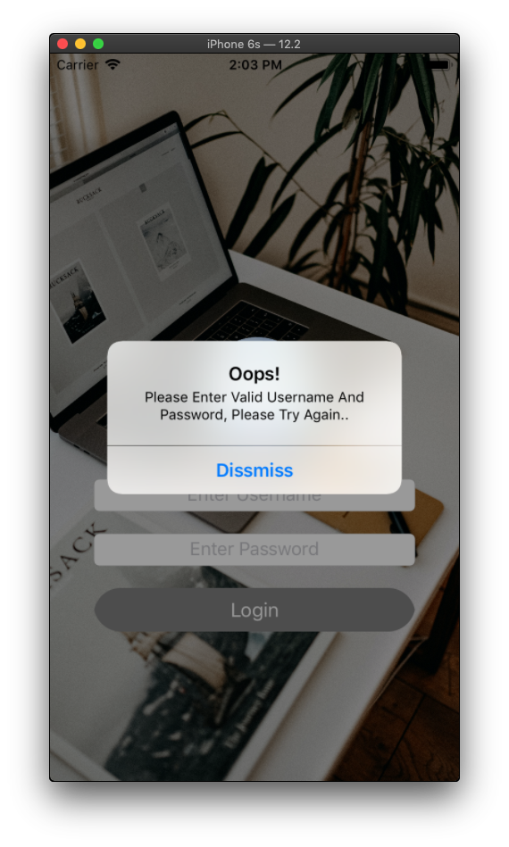
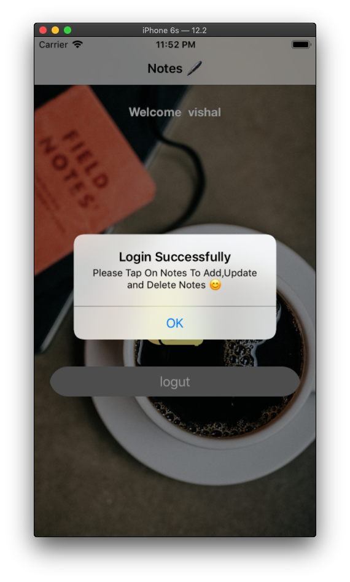
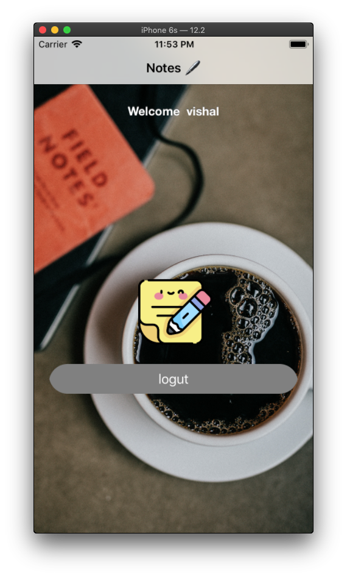
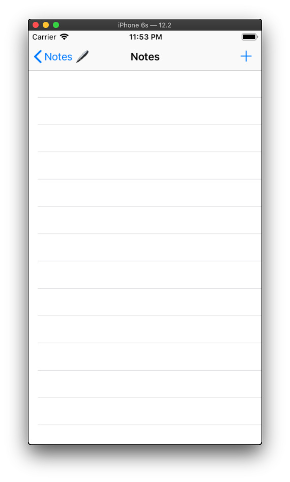
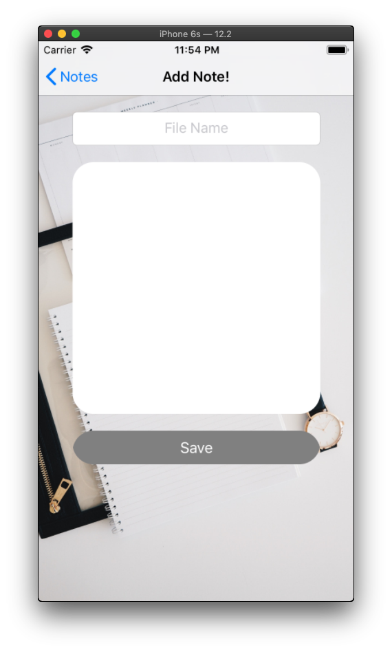
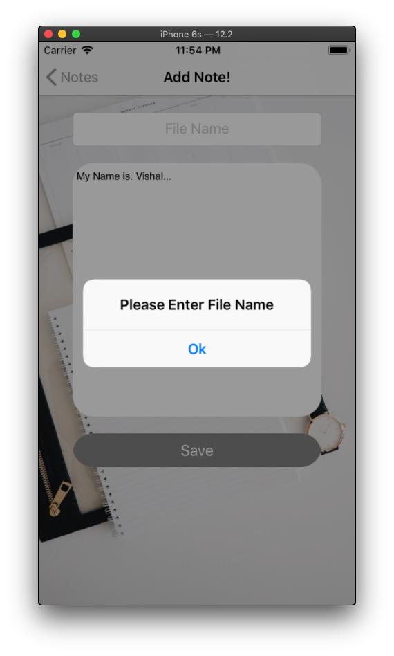
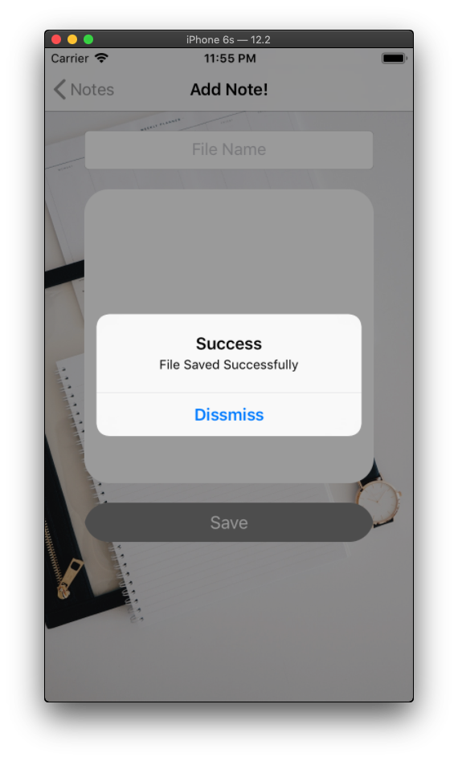
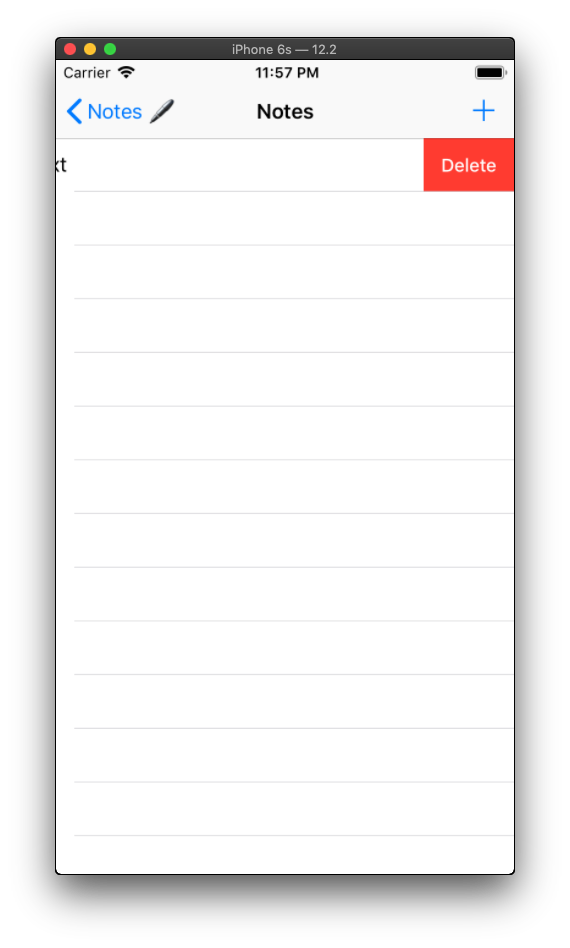

# NotesApp
 Simple NotesApp using FileManager and UserDefaults

### NotesApp Contain Functionality

- Login / Logout (with UserDefaults)
- Add new notes
- Modify existing note
- Delete notes

#### UIElements
 
 - UILabel
 - UIButton
 - UIImageView
 - UIAlertView
 - UITextField
 - UITextView
 - UIButton
 - UITableView
 
 ## How ImaGastures Work
 
 - Click On Play To see Full Demo
 
 

https://user-images.githubusercontent.com/70998696/124694145-52f85d00-defe-11eb-85e3-cb0e91da3bb8.mp4

 

 - Short Hand Demo
 - [x] Contain Login And Add Notes
 
 
 
 - [x] Contain Update and Delete Notes as well as Logout
 
 
 
 ### Output
  - Login Page With Validation And UserDefaults

  - Login Page With Validation And UserDefaults

 - Login Successfuly Alert

 - Notes Welcome Page

 - Notes Page (Show existing Note and also Add,Update and Remove Notes)

 - Add New notes and Update Notes

- File Name Validation

- Saved File Successfully

- Show Existing File

- Delete Notes

